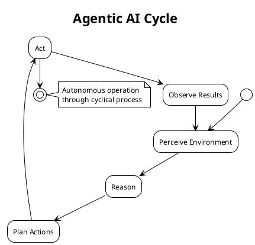
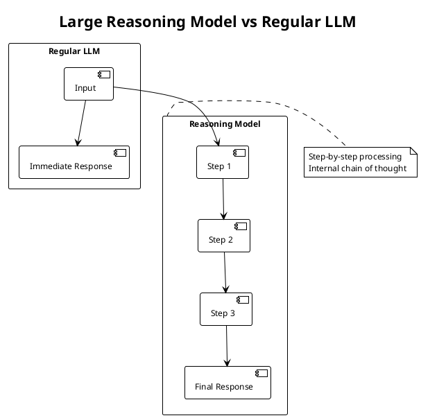
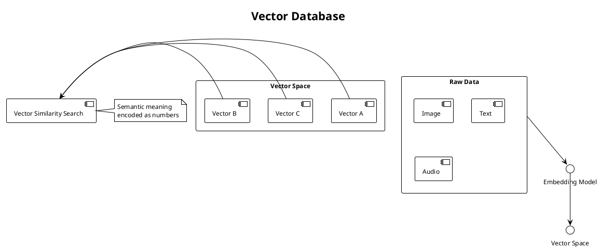
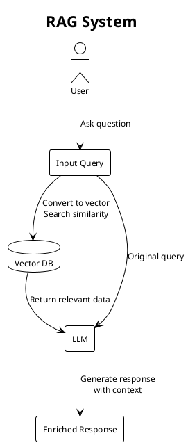
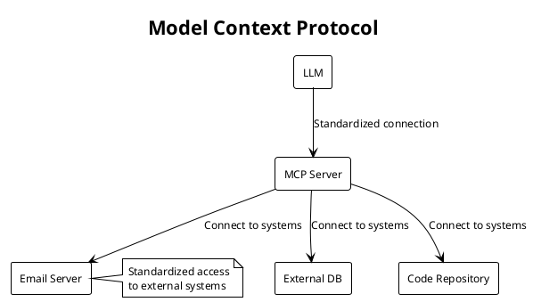
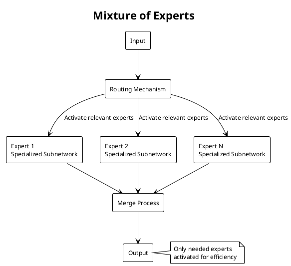
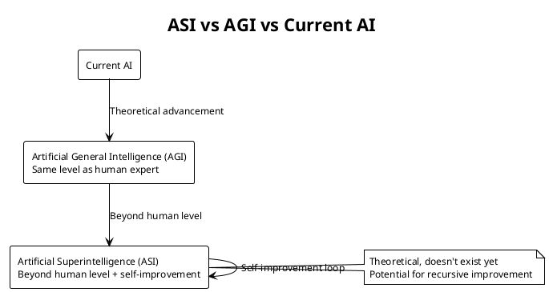

# Top 7 AI Terms Explained Concisely

This document provides concise explanations with PlantUML diagrams for the top 7 AI terms as outlined in the transcript.

## 1. Agentic AI

AI agents reason and act autonomously to achieve goals through perception, reasoning, action, and observation cycles.

## 2. Large Reasoning Models (LRM)

Specialized LLMs with reasoning-focused fine-tuning that process problems step by step rather than generating immediate responses.

## 3. Vector Database

Converts data into vectors (lists of numbers) that capture semantic meaning, enabling similarity searches as mathematical operations.

## 4. Retrieval Augmented Generation (RAG)

Uses vector databases to enrich LLM prompts with relevant external information.

## 5. Model Context Protocol (MCP)

Standardizes how applications provide context to LLMs, enabling standardized access to external tools and data sources.

## 6. Mixture of Experts (MoE)

Divides a large language model into specialized neural subnetworks, activating only those needed for a specific task.

## 7. Artificial Superintelligence (ASI)

Hypothetical AI system with intellectual capabilities beyond human level, potentially capable of recursive self-improvement.

## Summary

These seven terms represent key concepts in modern AI development:

- **Agentic AI**: Autonomous systems that reason and act
- **Large Reasoning Models**: LLMs that process step-by-step
- **Vector Databases**: Semantic search using mathematical representations
- **RAG**: Enhancing LLMs with external knowledge
- **MCP**: Standardized access to external systems
- **MoE**: Efficient model scaling through specialized subnetworks
- **ASI**: Hypothetical superhuman-level intelligence

Each concept addresses different challenges in AI development and deployment.