# Understanding Multi-Agent Systems: A Visual Guide

This document provides a visual explanation of multi-agent systems, based on the concepts discussed in the transcript. It covers what multi-agent systems are, common architectures, and communication patterns.

## Single Agent vs. Multi-Agent Systems

### Single Agent System
A single agent system consists of an LLM that calls multiple tools. While great for getting started, it can have some downsides as complexity increases.

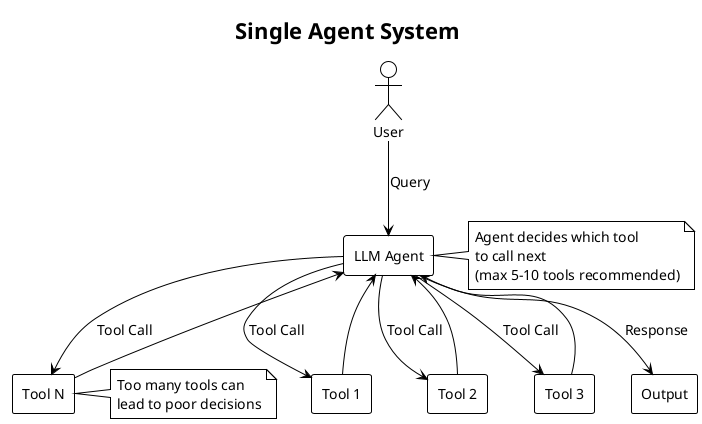

### Issues with Single Agent Systems
- **Too many tools**: Around 5-10 tools is the sweet spot; more can lead to poor decisions
- **Complex context**: Growing context can overwhelm the LLM
- **Lack of specialization**: All capabilities need to be in one agent

## Multi-Agent Systems Benefits

Multi-agent systems address the limitations of single agent systems by distributing responsibilities across multiple specialized agents.

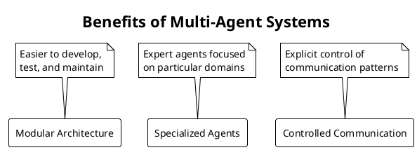

## Common Multi-Agent Architectures

### 1. Network of Agents
Agents communicate with each other by deciding who goes next. Frameworks like swarm and crewAI are known for this architecture.

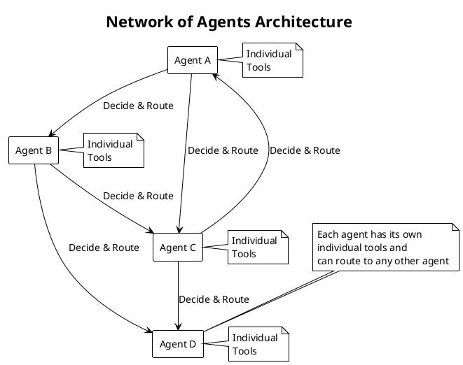

> **Note**: This architecture can be unreliable, costly, and lacks good control due to loose communication patterns.

### 2. Supervisor Agent Architecture
One agent is responsible for routing to other agents. Sub-agents focus solely on their tasks.

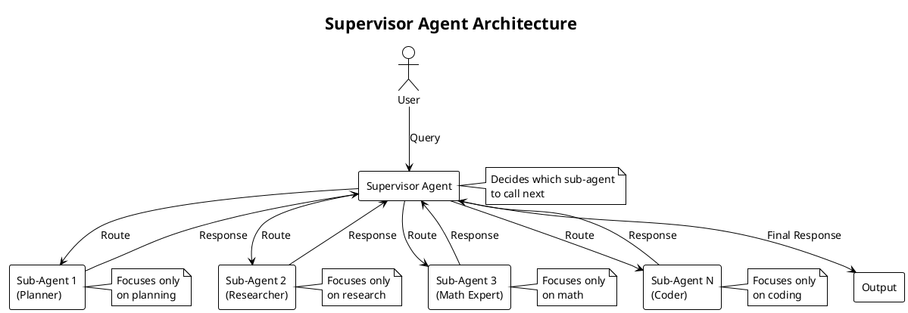

### 3. Supervisor with Tools Architecture
Sub-agents are treated as tools for a central LLM. Communication happens only through tool parameters.

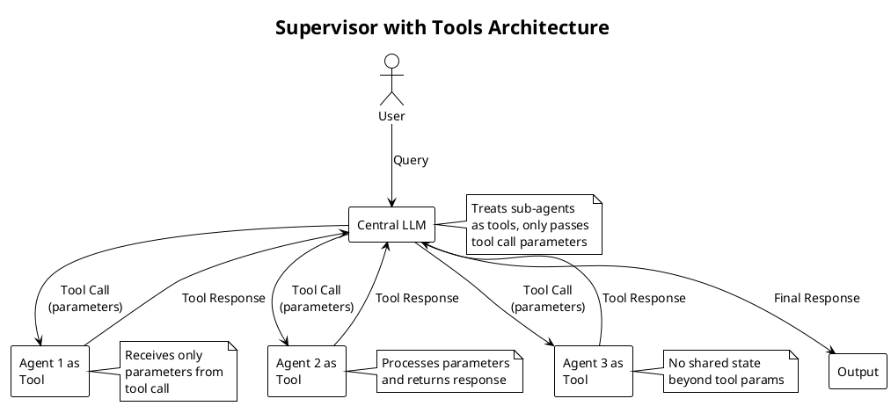

### 4. Hierarchical Architecture
Layering supervisor agents where sub-agents themselves can be supervisors.

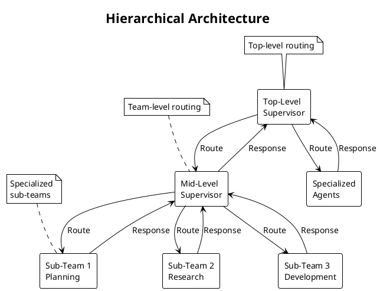

### 5. Custom Cognitive Architecture
Most common in production: custom architectures that borrow aspects of other approaches.

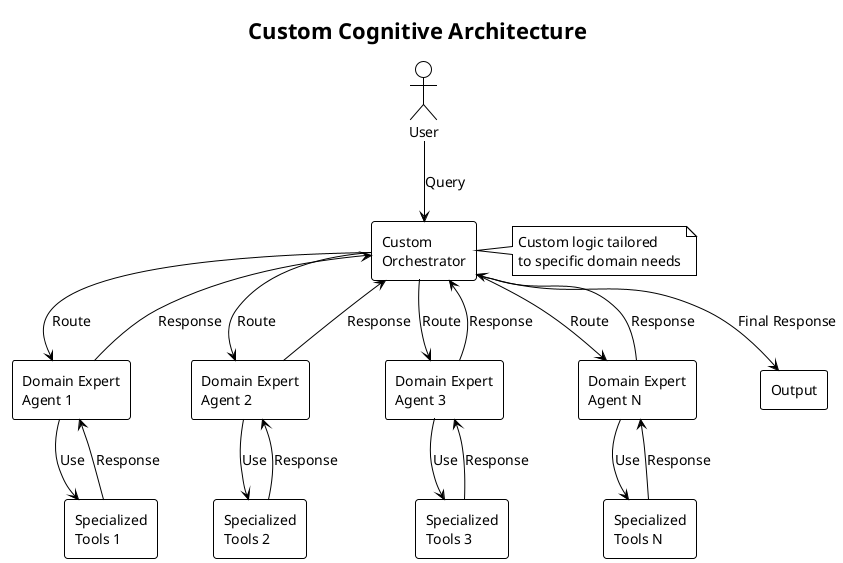

## Communication Patterns in Multi-Agent Systems

### 1. Shared State Communication
Agents communicate by sharing a common state object.

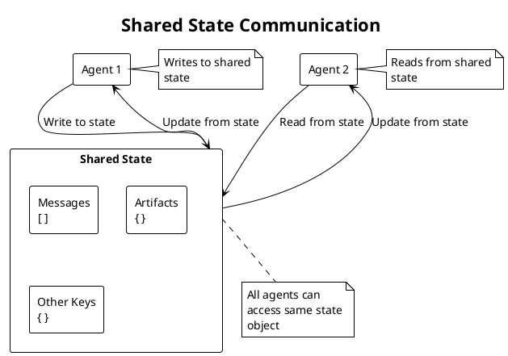

### 2. Tool-Call Communication
Agents communicate only through tool call parameters.

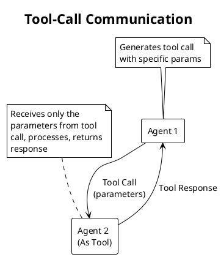

### 3. Different States Communication
Agents with different internal states can still communicate through shared keys.

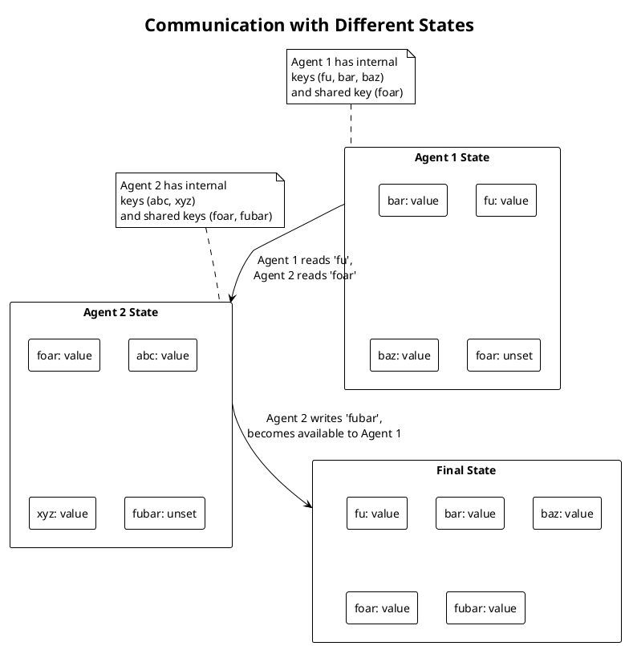

### 4. Message List Communication Patterns
Different strategies for handling messages between agents.

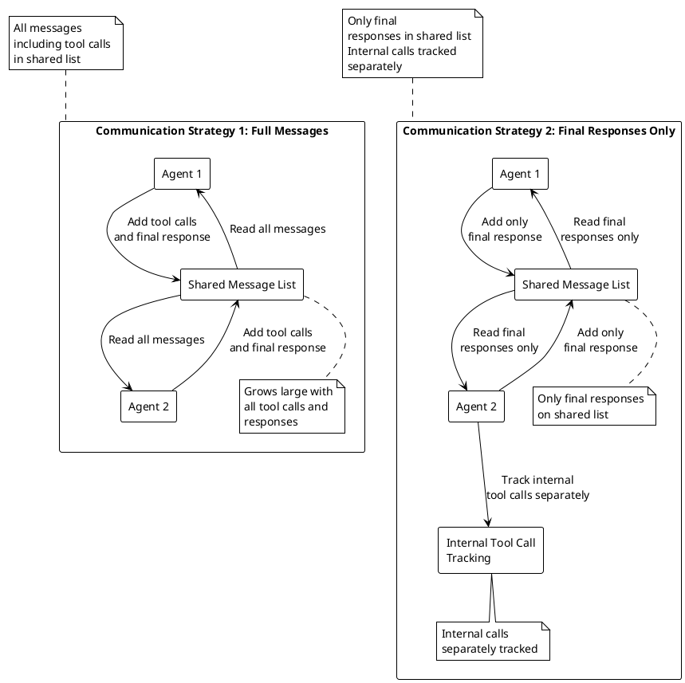

## Choosing the Right Architecture

Based on the transcript, the most common architecture seen in production is custom cognitive architectures. While it's valuable to understand supervisor and hierarchical systems, it's best to consider what system works best for your specific domain and build that using common techniques.

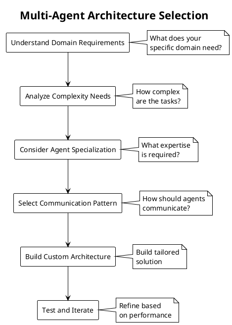

## Summary

Multi-agent systems represent a powerful evolution from single agent architectures. They address issues like:

- Tool overload in single agents
- Complex context management
- Need for specialized expertise

Key architectures include:
- Network of agents (less recommended for production)
- Supervisor agents (more manageable)
- Supervisor with tools (simpler but with communication limitations)
- Hierarchical systems (for complex organizations)
- Custom cognitive architectures (most common in production)

The communication approach you choose (shared state vs. tool call parameters) will impact how your agents interact and share information. For production systems, custom architectures that leverage these concepts but are tailored to specific domains tend to be most effective.