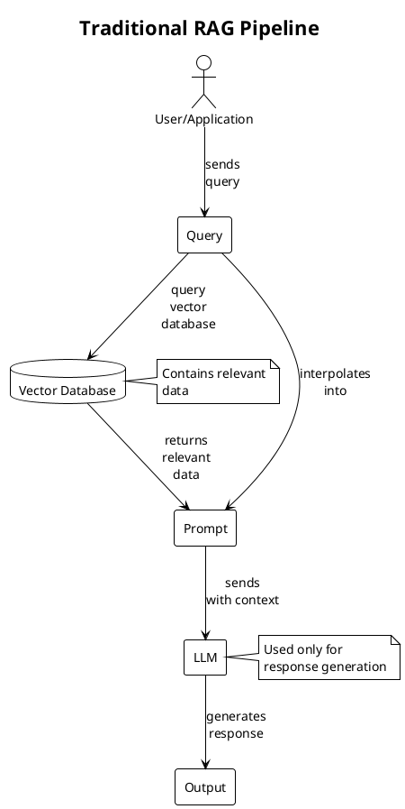
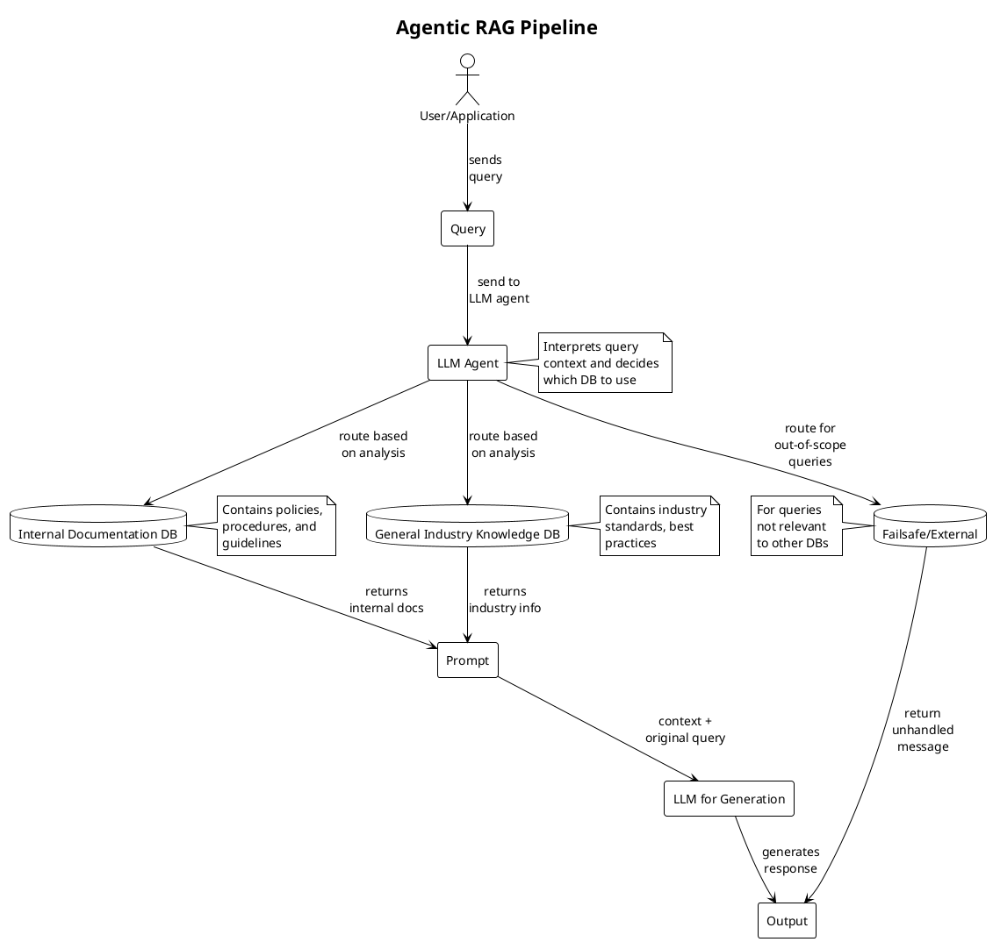
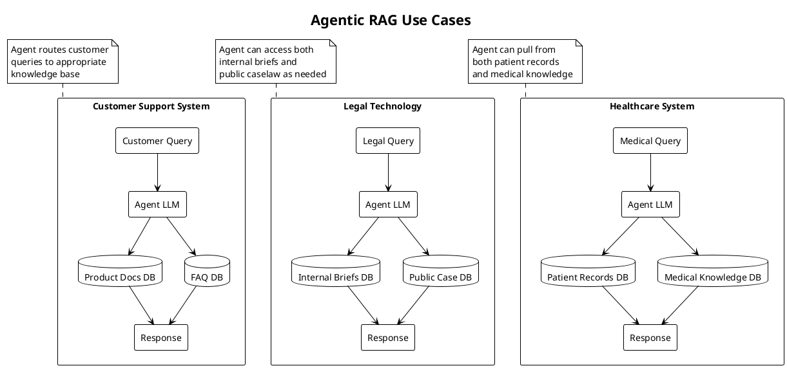
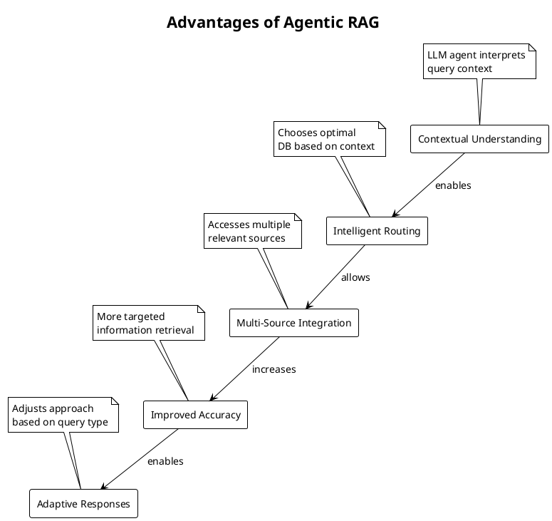

# Understanding RAG and Agentic RAG: A Visual Guide

https://www.youtube.com/watch?v=0z9_MhcYvcY

This document provides a visual explanation of Retrieval-Augmented Generation (RAG) and its evolution to Agentic RAG, based on the concepts discussed in the transcript.

## Traditional RAG Pipeline

Traditional RAG enhances responses from a large language model by incorporating relevant data retrieved from a vector database, adding it as context to the prompt, and sending it to the LLM for generation.

## Agentic RAG Pipeline

Agentic RAG uses the LLM as an agent that takes on an active role and can make decisions that improve both the relevance and accuracy of the retrieved data. It can intelligently decide which database to query based on the user's question.

## Use Cases for Agentic RAG

Here are some practical applications of the agentic RAG pipeline:

## Key Differences Between Traditional RAG and Agentic RAG

| Aspect | Traditional RAG | Agentic RAG |
|--------|----------------|-------------|
| **LLM Role** | Used solely for response generation | Used as an active agent for decision-making |
| **Data Source Decision** | Fixed single data source | Intelligent routing to multiple data sources |
| **Query Understanding** | Limited context understanding | Deep contextual analysis |
| **Flexibility** | Less flexible, single pipeline | Highly adaptable, multi-path pipeline |
| **Handling Out-of-Scope Queries** | May return irrelevant results | Routes to failsafe mechanism |

## Advantages of Agentic RAG

## Conclusion

Agentic RAG represents an evolution in how we enhance the RAG pipeline by moving beyond simple response generation to more intelligent decision making. By allowing an agent to choose the best data sources and potentially even incorporate external information like real-time data or third-party services, we create a pipeline that's more responsive, accurate, and adaptable. This approach opens up possibilities for applications in customer service, legal, tech, healthcare, and virtually any field as technology continues to evolve.